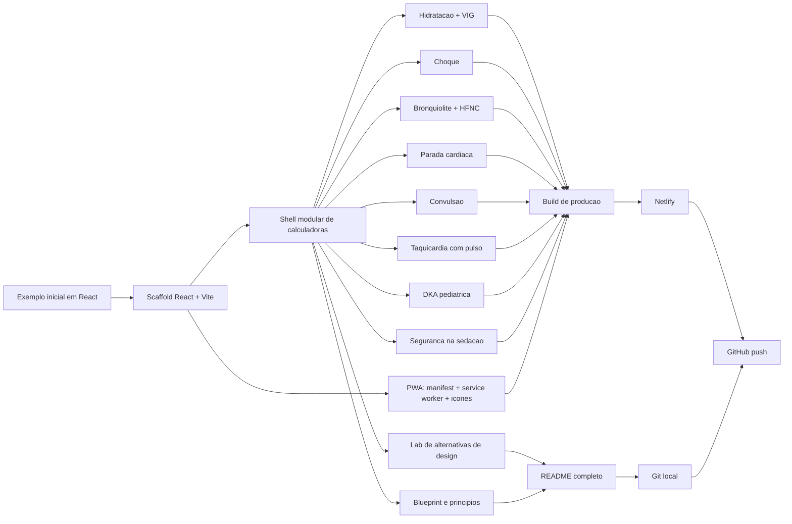

# Biblioteca de Calculadoras Clinicas

Colecao em React + Vite para calculadoras educacionais com foco em emergencia pediatrica. O projeto foi estruturado para uso rapido em desktop, tablet e celular, com publicacao em Netlify e suporte a instalacao como PWA.

## Links

- Producao no Netlify: `https://eclectic-macaron-6372b1.netlify.app`

## O que existe hoje

- Shell modular para calculadoras clinicas.
- PWA instalavel no celular.
- Modulos:
  - Hidratacao pediatrica
  - Bolus no choque
  - Bronquiolite + HFNC
  - Parada cardiaca pediatrica
  - Convulsao
  - Taquicardia com pulso
  - DKA pediatrica
  - Seguranca na sedacao
  - Alternativas de design
  - Blueprint e principios

## Stack

- React
- Vite
- lucide-react
- CSS customizado
- Netlify
- Service Worker manual

## Como rodar localmente

```bash
npm install
npm run dev
```

Abra `http://localhost:5173`.

## Como testar no celular na mesma rede

```bash
npm run dev -- --host 0.0.0.0
ipconfig getifaddr en0
```

Depois abra `http://SEU-IP:5173`.

## Como gerar build de producao

```bash
npm run build
```

Arquivos finais: pasta `dist/`.

## Como funciona a PWA

Arquivos principais:

- `public/manifest.webmanifest`
- `public/sw.js`
- `public/icon-192.png`
- `public/icon-512.png`
- `public/maskable-icon.png`

Registro do service worker:

- `src/main.jsx`

Configuracao HTML:

- `index.html`

### Como instalar no celular

Android:

1. Abra o site no Chrome.
2. Use `Install app` ou `Adicionar a tela inicial`.

iPhone/iPad:

1. Abra o site no Safari.
2. Toque em `Compartilhar`.
3. Escolha `Adicionar a Tela de Inicio`.

Observacao:

- Neste projeto, o service worker registra apenas em producao.
- O melhor lugar para testar instalacao e comportamento PWA e a URL do Netlify.

## Como publicar no Netlify

Primeira vez:

```bash
npx netlify login
npx netlify init
npx netlify deploy --prod
```

Depois que a pasta local estiver vinculada:

```bash
npx netlify deploy --prod
```

## Estrutura de pastas

```text
.
├── .gitignore
├── README.md
├── index.html
├── netlify.toml
├── package-lock.json
├── package.json
├── public
│   ├── app-icon.svg
│   ├── icon-192.png
│   ├── icon-512.png
│   ├── manifest.webmanifest
│   ├── maskable-icon.png
│   ├── maskable-icon.svg
│   └── sw.js
├── src
│   ├── App.jsx
│   ├── main.jsx
│   ├── styles.css
│   └── calculators
│       ├── CalculatorBlueprint.jsx
│       ├── DesignAlternativesLab.jsx
│       ├── PediatricBronchiolitisCalculator.jsx
│       ├── PediatricCardiacArrestCalculator.jsx
│       ├── PediatricDKACalculator.jsx
│       ├── PediatricHydrationCalculator.jsx
│       ├── PediatricSedationSafetyCalculator.jsx
│       ├── PediatricSeizureCalculator.jsx
│       ├── PediatricShockCalculator.jsx
│       ├── PediatricTachycardiaCalculator.jsx
│       └── shared.js
└── vite.config.js
```

## Diagrama Mermaid do que fizemos



## Principios de produto e design

1. Uma calculadora boa resolve um cenario por vez.
2. A formula deve ficar separada da leitura visual.
3. A tela precisa funcionar primeiro no celular.
4. Fontes oficiais devem aparecer dentro do modulo.
5. O tema visual precisa responder ao contexto de uso.

## Como usar esse aprendizado em novos projetos

- Comece pelo ponto de decisao, nao pelo componente.
- Descubra qual e a resposta principal que a tela deve devolver.
- Use uma estrutura repetivel: hero, entrada, resultado, fontes.
- Deixe o estilo compartilhado em um lugar e a logica clinica em outro.
- Documente deploy, estrutura e raciocinio desde o inicio.

## Ideias para continuar

- Modo plantao com cards ainda mais agressivos.
- URLs compartilhaveis com estado preenchido.
- Mais modulos: broncoespasmo, sepse, anafilaxia, ventilacao, drogas vasoativas.
- Tema institucional por hospital ou curso.
- Modo ensino com formulas destrinchadas em passos.

## Referencias clinicas

- AHA Pediatric Cardiac Arrest Algorithm:
  `https://cpr.heart.org/-/media/CPR-Files/CPR-Guidelines-Files/2025-Algorithms/Algorithm-PALS-CA-250123.pdf`
- AHA Managing Pediatric Shock Flowchart:
  `https://cpr.heart.org/-/media/cpr2-files/course-materials/2020-pals/2020-course-materials/managing-shock-flowchart_ucm_506723.pdf?la=en`
- AHA Pediatric Tachyarrhythmia Algorithm:
  `https://cpr.heart.org/-/media/CPR-Files/CPR-Guidelines-Files/2025-Accessible/Algorithm-PALS-Tachyarrhythmia-LngDscrp-250729-Ed.pdf?sc_lang=en`
- Bronchiolitis HFNC trial:
  `https://pubmed.ncbi.nlm.nih.gov/34342375/`
- Bronchiolitis HFNC review:
  `https://pubmed.ncbi.nlm.nih.gov/38506440/`
- CPS Status Epilepticus Algorithm:
  `https://cps.ca/uploads/documents/Status_epilepticus_algorithm.pdf`
- CPS Anticonvulsant Table:
  `https://cps.ca/uploads/documents/TABLE_2._Anticonvulsant_drug_therapies_for_convulsive_status_epilepticus_%28CSE%29_.pdf`
- ISPAD 2022 DKA guideline:
  `https://www.ispad.org/static/6dd62eae-c8cb-4b4a-84e1efc768505746/Ch11PediatricDiabetes.pdf`
- CPS Procedural Sedation guideline:
  `https://cps.ca/documents/position/recommendations-for-procedural-sedation-in-infants-children-and-adolescents`

## Git

Para ver o historico:

```bash
git log --oneline --decorate
```

Para publicar em um remoto depois de configurado:

```bash
git push -u origin main
```
