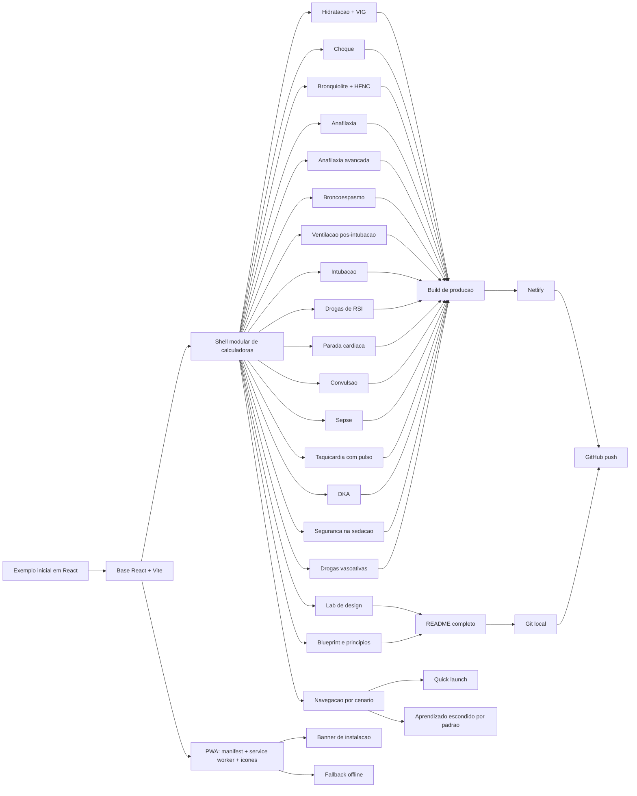

# Biblioteca de Calculadoras Clinicas

Colecao em React + Vite para calculadoras educacionais com foco em emergencia pediatrica. O projeto foi estruturado para uso rapido em desktop, tablet e celular, com publicacao em Netlify, instalacao como PWA e suporte offline reforcado.

## Links

- Producao no Netlify: `https://eclectic-macaron-6372b1.netlify.app`
- GitHub: `https://github.com/diogene5/gemini_codex_calculadoras`

## O que existe hoje

- Shell modular para calculadoras clinicas.
- Navegacao reorganizada por cenario clinico.
- Acesso rapido para modulos mais urgentes.
- Modulos de aprendizado escondidos por padrao para reduzir ruido na tela principal.
- PWA instalavel com banner de instalacao.
- Modo offline com cache do shell, assets e fallback de navegacao.
- Modulos clinicos:
  - Hidratacao pediatrica
  - Bolus no choque
  - Bronquiolite + HFNC
  - Anafilaxia
  - Anafilaxia avancada
  - Broncoespasmo
  - Ventilacao pos-intubacao
  - Intubacao
  - Drogas de sequencia rapida
  - Parada cardiaca pediatrica
  - Convulsao
  - Sepse pediatrica
  - Taquicardia com pulso
  - DKA pediatrica
  - Seguranca na sedacao
  - Drogas vasoativas
- Modulos de aprendizado:
  - Alternativas de design
  - Blueprint e principios

## Stack

- React
- Vite
- lucide-react
- CSS customizado
- Netlify
- Service Worker manual
- Manifest PWA manual

## O que e PWA

PWA significa `Progressive Web App`.

Na pratica:

- e um site que se comporta mais como app
- pode ser instalado na tela inicial do celular
- pode abrir em tela cheia ou quase isso
- pode manter parte do conteudo em cache para continuar util offline

Conceitos principais:

- `site` e o canal de distribuicao
- `manifest` diz nome, icone e comportamento de instalacao
- `service worker` cuida de cache, offline e parte da experiencia de app

## Como rodar localmente

```bash
npm install
npm run dev
```

Abra `http://localhost:5173`.

## Como testar no celular na mesma rede

```bash
npm run dev -- --host 0.0.0.0
ipconfig getifaddr en0
```

Depois abra `http://SEU-IP:5173`.

## Como gerar build de producao

```bash
npm run build
```

Arquivos finais: pasta `dist/`.

## Como funciona a PWA

Arquivos principais:

- `public/manifest.webmanifest`
- `public/sw.js`
- `public/offline.html`
- `public/icon-192.png`
- `public/icon-512.png`
- `public/maskable-icon.png`
- `src/components/PwaInstallBanner.jsx`
- `src/main.jsx`
- `index.html`

### O que a PWA faz

- Registra o service worker apenas em producao.
- Exibe banner de instalacao quando o navegador permite.
- Exibe orientacao manual no iPhone/iPad.
- Mostra aviso quando o dispositivo fica offline.
- Mantem o shell do app, assets visitados e fallback de navegacao em cache.

### Como instalar no celular

Android:

1. Abra o site no Chrome.
2. Aceite o banner `Instalar` ou use `Install app`.

iPhone/iPad:

1. Abra o site no Safari.
2. Toque em `Compartilhar`.
3. Escolha `Adicionar a Tela de Inicio`.

Observacao:

- O melhor lugar para validar instalacao e offline e a URL do Netlify.

## Como publicar no Netlify

Primeira vez:

```bash
npx netlify login
npx netlify init
npx netlify deploy --prod
```

Depois que a pasta local estiver vinculada:

```bash
npx netlify deploy --prod
```

## Revisao de design aplicada

Problemas que apareciam antes:

- a primeira dobra mobile gastava espaco demais com branding e texto longo
- a navegacao parecia catalogo grande demais e pouco “plantao”
- havia repeticao de explicacao em hero, header e cards
- modulos de design competiam com calculadoras clinicas na tela principal

Mudancas feitas:

- hero compactado com chips de acesso rapido
- agrupamento por cenario: plantao, via aerea, respiratorio, metabolico e suporte
- modulos de aprendizado escondidos por padrao
- cards de navegacao reduzidos para nome + subtitle
- texto secundario retirado da primeira dobra mobile

Principio por tras disso:

- em produto clinico, a primeira pergunta da tela deve ser `qual decisao preciso tomar agora?`

## Estrutura de pastas

```text
.
├── .gitignore
├── README.md
├── index.html
├── netlify.toml
├── package-lock.json
├── package.json
├── public
│   ├── app-icon.svg
│   ├── icon-192.png
│   ├── icon-512.png
│   ├── manifest.webmanifest
│   ├── maskable-icon.png
│   ├── maskable-icon.svg
│   ├── offline.html
│   └── sw.js
├── src
│   ├── App.jsx
│   ├── main.jsx
│   ├── styles.css
│   ├── calculators
│   │   ├── CalculatorBlueprint.jsx
│   │   ├── DesignAlternativesLab.jsx
│   │   ├── PediatricAnaphylaxisCalculator.jsx
│   │   ├── PediatricAdvancedAnaphylaxisCalculator.jsx
│   │   ├── PediatricBronchiolitisCalculator.jsx
│   │   ├── PediatricBronchospasmCalculator.jsx
│   │   ├── PediatricCardiacArrestCalculator.jsx
│   │   ├── PediatricDKACalculator.jsx
│   │   ├── PediatricHydrationCalculator.jsx
│   │   ├── PediatricIntubationCalculator.jsx
│   │   ├── PediatricRSICalculator.jsx
│   │   ├── PediatricSedationSafetyCalculator.jsx
│   │   ├── PediatricSeizureCalculator.jsx
│   │   ├── PediatricSepsisCalculator.jsx
│   │   ├── PediatricShockCalculator.jsx
│   │   ├── PediatricTachycardiaCalculator.jsx
│   │   ├── PediatricVentilationCalculator.jsx
│   │   ├── VasoactiveInfusionCalculator.jsx
│   │   └── shared.js
│   └── components
│       └── PwaInstallBanner.jsx
└── vite.config.js
```

## Diagrama Mermaid do que fizemos



## Principios de produto e design

1. Uma calculadora boa resolve um cenario por vez.
2. A formula deve ficar separada da leitura visual.
3. A tela precisa funcionar primeiro no celular.
4. Fontes oficiais devem aparecer dentro do modulo.
5. O tema visual precisa responder ao contexto de uso.

## Como usar esse aprendizado em novos projetos

- Comece pelo ponto de decisao, nao pelo componente.
- Descubra qual e a resposta principal da tela.
- Use uma estrutura repetivel: hero, entrada, resultado, fontes.
- Mantenha o estilo compartilhado e a logica do dominio em lugares diferentes.
- Pense em distribuicao desde o inicio: web, PWA, deploy, offline e documentacao.

## Benchmark rapido

Apps e produtos semelhantes que valem observar:

- MDCalc: excelente em busca rapida, densidade util e reducao de atrito
- Pedi STAT: referencia classica de ergonomia para emergencias pediatricas
- Figma Community: boa para observar bibliotecas mobile de healthcare e emergency UI

O que puxei dessas referencias:

- menos texto na navegacao
- hierarquia forte do numero principal
- agrupamento por tarefa e nao por “tipo de componente”
- primeira dobra pensada para pressa real, nao para apresentar o projeto

## Referencias de produto e design

- web.dev PWA learning hub:
  `https://web.dev/learn/pwa/`
- Chrome developers, installability/PWA:
  `https://developer.chrome.com/docs/capabilities/pwa-install/`
- Apple Human Interface Guidelines:
  `https://developer.apple.com/design/human-interface-guidelines/`
- Material 3 accessible design:
  `https://m3.material.io/foundations/accessible-design/overview`
- Health.gov health literacy:
  `https://health.gov/our-work/national-health-initiatives/health-literacy`
- MDCalc:
  `https://www.mdcalc.com/`
- Pedi STAT:
  `https://www.pedistat.com/`
- Figma Community:
  `https://www.figma.com/community`

## Ideias para continuar

- Modo plantao com cards ainda mais agressivos.
- URLs compartilhaveis com estado preenchido.
- Mais modulos: anafilaxia peri-arrest, ventilacao nao invasiva, broncoespasmo ventilado, drogas de infusao continua.
- Tema institucional por hospital ou curso.
- Modo ensino com formulas destrinchadas em passos.

## Referencias clinicas

- AHA Pediatric Cardiac Arrest Algorithm:
  `https://cpr.heart.org/-/media/CPR-Files/CPR-Guidelines-Files/2025-Algorithms/Algorithm-PALS-CA-250123.pdf`
- AHA Managing Pediatric Shock Flowchart:
  `https://cpr.heart.org/-/media/cpr2-files/course-materials/2020-pals/2020-course-materials/managing-shock-flowchart_ucm_506723.pdf?la=en`
- AHA Pediatric Tachyarrhythmia Algorithm:
  `https://cpr.heart.org/-/media/CPR-Files/CPR-Guidelines-Files/2025-Accessible/Algorithm-PALS-Tachyarrhythmia-LngDscrp-250729-Ed.pdf?sc_lang=en`
- Bronchiolitis HFNC trial:
  `https://pubmed.ncbi.nlm.nih.gov/34342375/`
- Bronchiolitis HFNC review:
  `https://pubmed.ncbi.nlm.nih.gov/38506440/`
- ASCIA Acute Management of Anaphylaxis:
  `https://allergy.org.au/images/ASCIA_HP_Guidelines_Acute_Management_Anaphylaxis_2024.pdf`
- CPS Stinging Insect Hypersensitivity:
  `https://cps.ca/documents/position/stinging-insect-hypersensitivity`
- CPS Acute Asthma algorithms:
  `https://cps.ca/uploads/documents/All_algorithms_and_additional_documents.pdf`
- CPS Status Epilepticus Algorithm:
  `https://cps.ca/uploads/documents/Status_epilepticus_algorithm.pdf`
- CPS Anticonvulsant Table:
  `https://cps.ca/uploads/documents/TABLE_2._Anticonvulsant_drug_therapies_for_convulsive_status_epilepticus_%28CSE%29_.pdf`
- ISPAD 2022 DKA guideline:
  `https://www.ispad.org/static/6dd62eae-c8cb-4b4a-84e1efc768505746/Ch11PediatricDiabetes.pdf`
- CPS Procedural Sedation guideline:
  `https://cps.ca/documents/position/recommendations-for-procedural-sedation-in-infants-children-and-adolescents`
- SSC pediatric initial resuscitation algorithm:
  `https://sccm.org/Admin/getmedia/cde6bdbd-cd1f-4ca9-a394-0673bdaba71b/Initial-Resuscitation-Algorithm-for-Children.pdf`
- CPS Sepsis guideline:
  `https://cps.ca/documents/position/diagnosis-and-management-of-sepsis-in-the-paediatric-patient`
- ACI APLS formulas:
  `https://aci.health.nsw.gov.au/ecat/appendices/apls-formula`
- ACI Emergency Resuscitation Cue Lanyard Card:
  `https://aci.health.nsw.gov.au/__data/assets/pdf_file/0010/495757/Emergency-Resuscitation-Cue-Lanyard-Card.pdf`
- RCH Emergency airway management:
  `https://www.rch.org.au/clinicalguide/guideline_index/Emergency_airway_management/`
- RCH Trauma airway management:
  `https://www.rch.org.au/trauma-service/manual/airway-management/`
- ECI Ventilation in the crashing asthmatic:
  `https://aci.health.nsw.gov.au/networks/eci/clinical/tools/respiratory/asthma/the-crashing-patient-life-threatening-asthma/ventilation-in-the-crashing-asthmatic`
- RCH anaphylaxis clinical resources:
  `https://www.rch.org.au/anaphylaxis/clinical_resources/`
- Queensland anaphylaxis medication flowchart:
  `https://www.childrens.health.qld.gov.au/health-a-to-z/anaphylaxis/medication-flowchart`
- eCAT paediatric anaphylaxis:
  `https://aci.health.nsw.gov.au/ecat/paediatric/anaphylaxis`
- Queensland childrens resuscitation emergency drug dosage:
  `https://www.childrens.health.qld.gov.au/__data/assets/pdf_file/0034/296647/childrens-resuscitation-emergency-drug-dosage.pdf`

## Git

Para ver o historico:

```bash
git log --oneline --decorate
```

Para publicar no remoto configurado:

```bash
git push -u origin main
```
