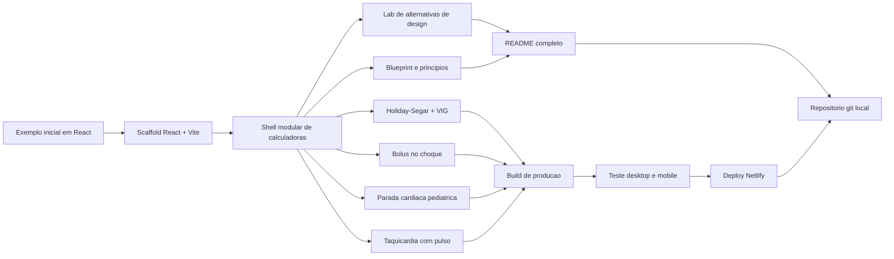

# Biblioteca de Calculadoras Clinicas

Colecao em React + Vite para calculadoras educacionais com foco em emergencia pediatrica, desenhada para funcionar bem em desktop, tablet e celular.

## Versao publicada

- Producao no Netlify: `https://eclectic-macaron-6372b1.netlify.app`

## O que foi construido

- Shell visual reutilizavel para calculadoras clinicas.
- Modulo de hidratacao pediatrica com Holiday-Segar + VIG.
- Modulo de bolus no choque.
- Modulo de parada cardiaca pediatrica.
- Modulo de taquicardia com pulso.
- Lab de alternativas de design.
- Blueprint com principios para expandir a colecao.

## Stack

- React
- Vite
- lucide-react
- CSS customizado em `src/styles.css`
- Netlify para publicacao

## Como reproduzir localmente

No diretorio do projeto:

```bash
npm install
npm run dev
```

Abra `http://localhost:5173`.

## Como testar no celular na mesma rede

```bash
npm run dev -- --host 0.0.0.0
ipconfig getifaddr en0
```

Depois abra `http://SEU-IP:5173` no celular.

## Como gerar build de producao

```bash
npm run build
```

Arquivos finais: pasta `dist/`.

## Como publicar no Netlify

Este projeto ja tem `netlify.toml`.

Primeira vez:

```bash
npx netlify login
npx netlify init
npx netlify deploy --prod
```

Depois que a pasta local estiver vinculada ao site:

```bash
npx netlify deploy --prod
```

## Estrutura de pastas

```text
.
├── .gitignore
├── README.md
├── index.html
├── netlify.toml
├── package-lock.json
├── package.json
├── src
│   ├── App.jsx
│   ├── main.jsx
│   ├── styles.css
│   └── calculators
│       ├── CalculatorBlueprint.jsx
│       ├── DesignAlternativesLab.jsx
│       ├── PediatricCardiacArrestCalculator.jsx
│       ├── PediatricHydrationCalculator.jsx
│       ├── PediatricShockCalculator.jsx
│       ├── PediatricTachycardiaCalculator.jsx
│       └── shared.js
└── vite.config.js
```

## Como o app esta organizado

- `src/App.jsx`
  Catalogo lateral, selecao do modulo ativo e shell principal.
- `src/calculators/`
  Cada calculadora e um modulo independente.
- `src/calculators/shared.js`
  Helpers reutilizados entre os modulos.
- `src/styles.css`
  Tokens visuais, layout, paineis, temas e previews.
- `vite.config.js`
  Configuracao do Vite e liberacao de `allowedHosts`.

## Diagrama Mermaid do que fizemos



## Principios de design aprendidos aqui

1. Uma calculadora boa resolve um cenario por vez.
2. A formula deve ficar separada da interpretacao visual.
3. O layout precisa funcionar primeiro no celular.
4. Fontes oficiais visiveis aumentam confianca em contexto clinico.
5. Variacoes de design devem responder ao contexto de uso, nao a moda.

## Alternativas de design testadas

- `Triage Board`
  Melhor quando a urgencia precisa ser vista em segundos.
- `Protocol Console`
  Melhor quando o usuario precisa seguir uma sequencia e aprender junto.
- `Night Shift`
  Melhor para uso prolongado e ambientes com pouca luz.

Essas alternativas estao implementadas no modulo `DesignAlternativesLab.jsx`.

## Como levar esse aprendizado para novos projetos

- Comece pelo cenario de decisao, nao pelo componente.
- Defina qual dado e a resposta principal da tela.
- Escolha uma linguagem visual coerente com o ambiente de uso.
- Mantenha componentes reaproveitaveis, mas preserve identidade por contexto.
- Documente as fontes e a arquitetura desde o inicio.

## Ideias para proximos modulos

- Bronquiolite e suporte respiratorio.
- Cetoacidose diabetica pediatrica.
- Convulsao e sedacao.
- Drogas vasoativas.
- PWA instalavel no celular.
- URLs compartilhaveis com estado preenchido.
- Modo "plantao" com interface ultra-rapida.

## Referencias clinicas usadas

- AHA Pediatric Cardiac Arrest Algorithm:
  `https://cpr.heart.org/-/media/CPR-Files/CPR-Guidelines-Files/2025-Algorithms/Algorithm-PALS-CA-250123.pdf`
- AHA Managing Pediatric Shock Flowchart:
  `https://cpr.heart.org/-/media/cpr2-files/course-materials/2020-pals/2020-course-materials/managing-shock-flowchart_ucm_506723.pdf?la=en`
- AHA Pediatric Tachyarrhythmia Algorithm:
  `https://cpr.heart.org/-/media/CPR-Files/CPR-Guidelines-Files/2025-Accessible/Algorithm-PALS-Tachyarrhythmia-LngDscrp-250729-Ed.pdf?sc_lang=en`
- Surviving Sepsis Campaign Pediatric Guidelines:
  `https://www.sccm.org/survivingsepsiscampaign/guidelines-and-resources/surviving-sepsis-campaign-pediatric-guidelines`

## Git

Repositorio git local inicializado em `main`.

Para ver os commits:

```bash
git log --oneline --decorate
```
